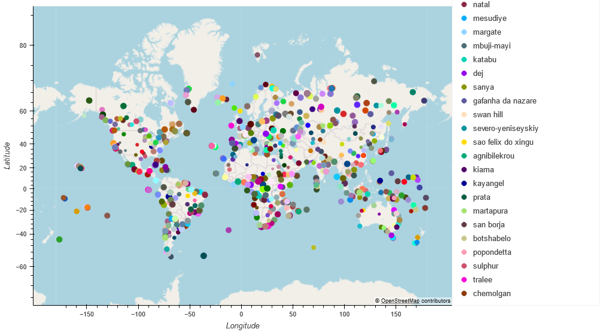
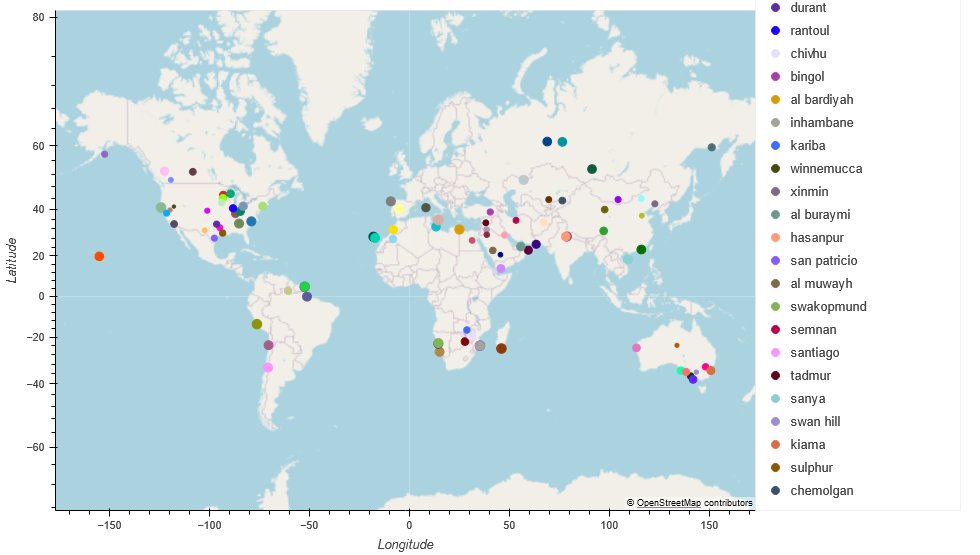

# python_api_challenge
Module 6 Challenge for weather analysis and accordingly vacation planning

**Note** :The <u>interative Map plots</u> that are generated by the the VacationPy.ipyng notebook and viweable on my local machine, are not vieweable on the github copy because GitHub does not support rendering interactive plots directly (such as those created with hvplot, bokeh, or plotly) in Jupyter notebooks. However, we can use **nbviewer** to generate a link to make the interactive maps viewable when the notebook is hosted on GitHub:
Accordingly, 'the notebook "VacationPy.ipynb" containing interactive maps' can be viewed via the linke generated by nbviewer [HERE.](https://nbviewer.org/github/SunilduthBaichoo/python_api_challenge/blob/main/VacationPy.ipynb)

Please also find below **saved static versions of the maps**.

### Map1

### Map2

